# アーキテクチャドキュメント

## 📋 目次

1. [概要](#概要)
2. [システムアーキテクチャ](#システムアーキテクチャ)
3. [データフロー](#データフロー)
4. [シーケンス図](#シーケンス図)
5. [データモデル](#データモデル)
6. [ディレクトリ構造](#ディレクトリ構造)
7. [セキュリティアーキテクチャ](#セキュリティアーキテクチャ)
8. [レジリエンスアーキテクチャ](#レジリエンスアーキテクチャ)
9. [多言語アーキテクチャ](#多言語アーキテクチャ)
10. [パフォーマンス最適化](#パフォーマンス最適化)

---

## 概要

### アーキテクチャの設計原則

1. **シンプルさ**: 必要最小限のコンポーネントで構成
2. **拡張性**: 将来的なスケーリングに対応
3. **保守性**: 理解しやすく、修正しやすい構造
4. **セキュリティ**: 多層防御による安全性確保
5. **レジリエンス**: 障害に強い自動復旧機能

### 主要技術決定

| 技術選定 | 理由 |
|---------|------|
| **FastAPI** | 高速、型安全、自動API文書生成 |
| **SQLite** | シンプル、ファイルベース、依存関係なし |
| **Uvicorn** | 高速ASGI、非同期対応 |
| **Apache HTTPD** | 実績豊富、SSL/TLS対応、Basic認証 |
| **OpenAI API** | 高精度AI、コスト効率的（gpt-4o-mini） |
| **systemd** | 標準的なプロセス管理、自動再起動 |

---

## システムアーキテクチャ

### 全体構成図

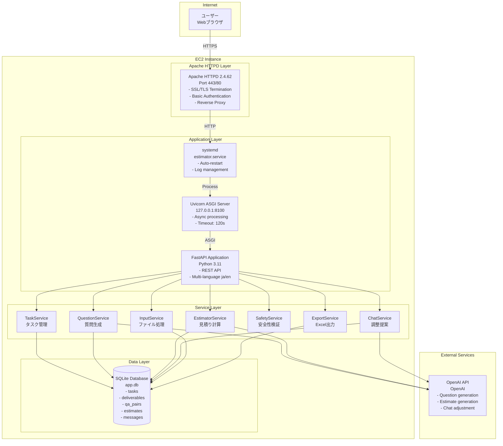

### レイヤー詳細

#### 1. フロントエンドレイヤー

**構成**:
- Vanilla JavaScript
- Chart.js (グラフ描画)
- HTML5/CSS3

**責務**:
- ユーザーインターフェース表示
- ユーザー入力の収集
- API呼び出し
- 結果の視覚化

#### 2. プロキシレイヤー (Apache HTTPD)

**責務**:
- SSL/TLS終端
- Basic認証
- リバースプロキシ
- HTTP→HTTPSリダイレクト

**設定**:
```apache
ProxyPass /api/ http://127.0.0.1:8100/api/ timeout=600
ProxyPass /static/ http://127.0.0.1:8100/static/ timeout=600
ProxyPass / http://127.0.0.1:8100/ui/ timeout=600
```

#### 3. アプリケーションレイヤー (FastAPI)

**責務**:
- REST APIエンドポイント提供
- リクエストバリデーション
- ビジネスロジック実行
- レスポンス生成

**主要エンドポイント**:
- `POST /api/v1/tasks` - タスク作成
- `GET /api/v1/tasks/{id}/questions` - 質問取得
- `POST /api/v1/tasks/{id}/answers` - 回答送信
- `GET /api/v1/tasks/{id}/result` - 結果取得
- `POST /api/v1/tasks/{id}/chat` - 調整リクエスト

#### 4. サービスレイヤー

**TaskService**:
- タスクライフサイクル管理
- 見積りプロセス全体の制御

**QuestionService**:
- AI質問生成
- OpenAI APIとの連携

**EstimatorService**:
- 見積り計算ロジック
- 工数・金額算出

**ChatService**:
- 調整提案生成
- AI対話制御

**SafetyService**:
- プロンプトインジェクション検出
- 不適切コンテンツフィルタリング

**InputService**:
- Excel/CSVパース
- データ抽出・バリデーション

**ExportService**:
- Excelファイル生成
- フォーマット整形

#### 5. データレイヤー (SQLite)

**責務**:
- データ永続化
- トランザクション管理
- クエリ実行

---

## データフロー

### タスク作成〜見積り生成フロー

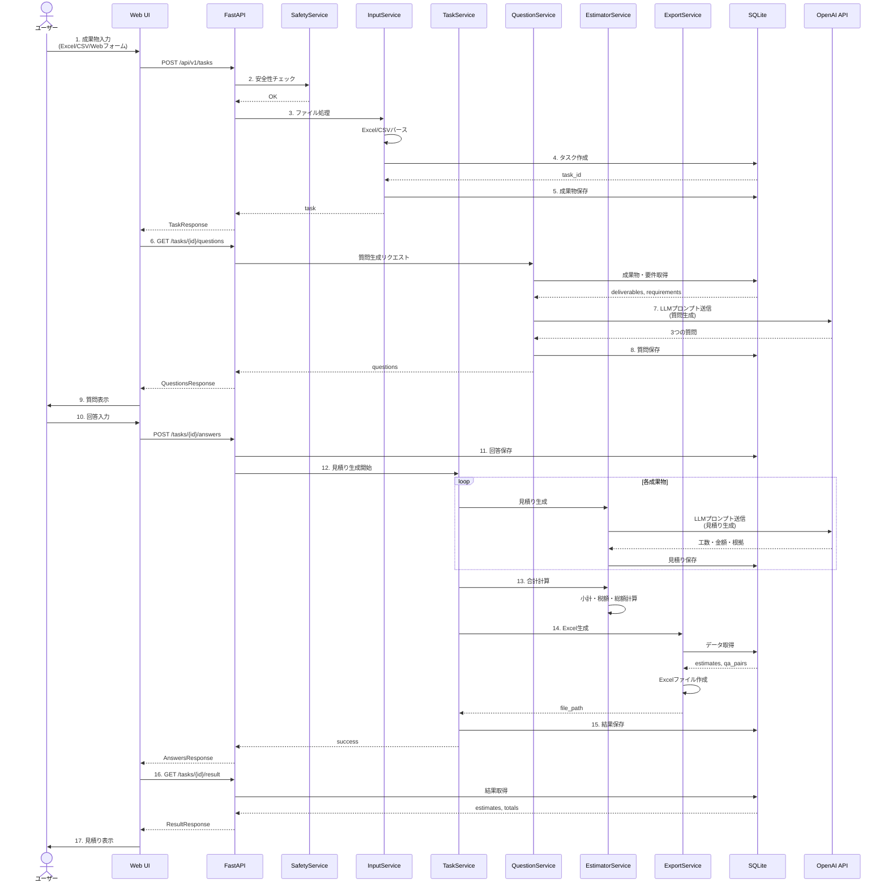

### チャット調整フロー

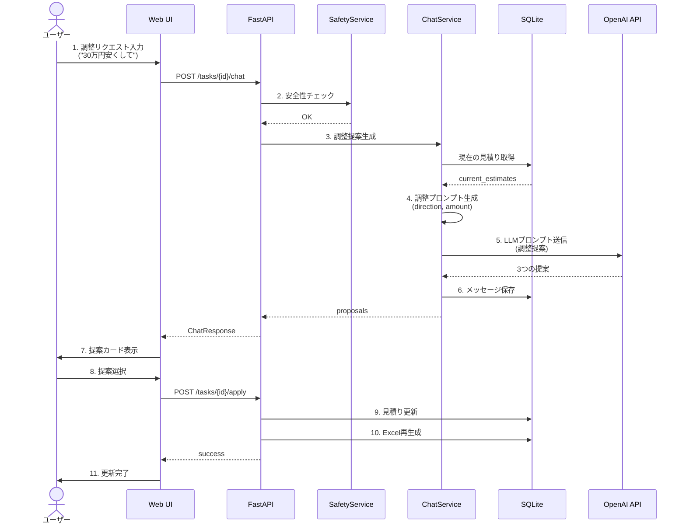

---

## シーケンス図

### タスク作成詳細シーケンス

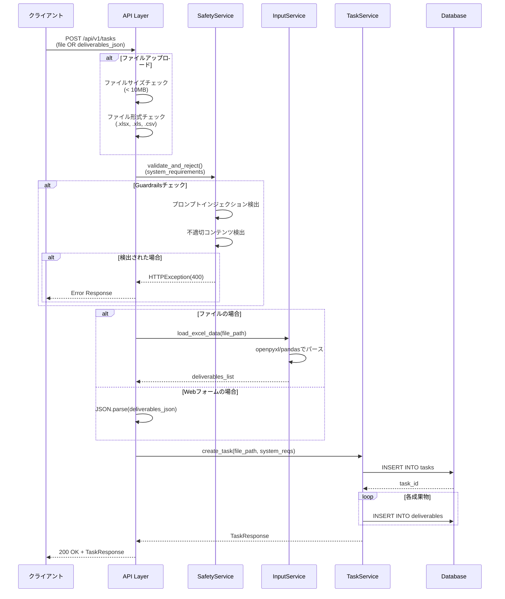

### 見積り生成詳細シーケンス

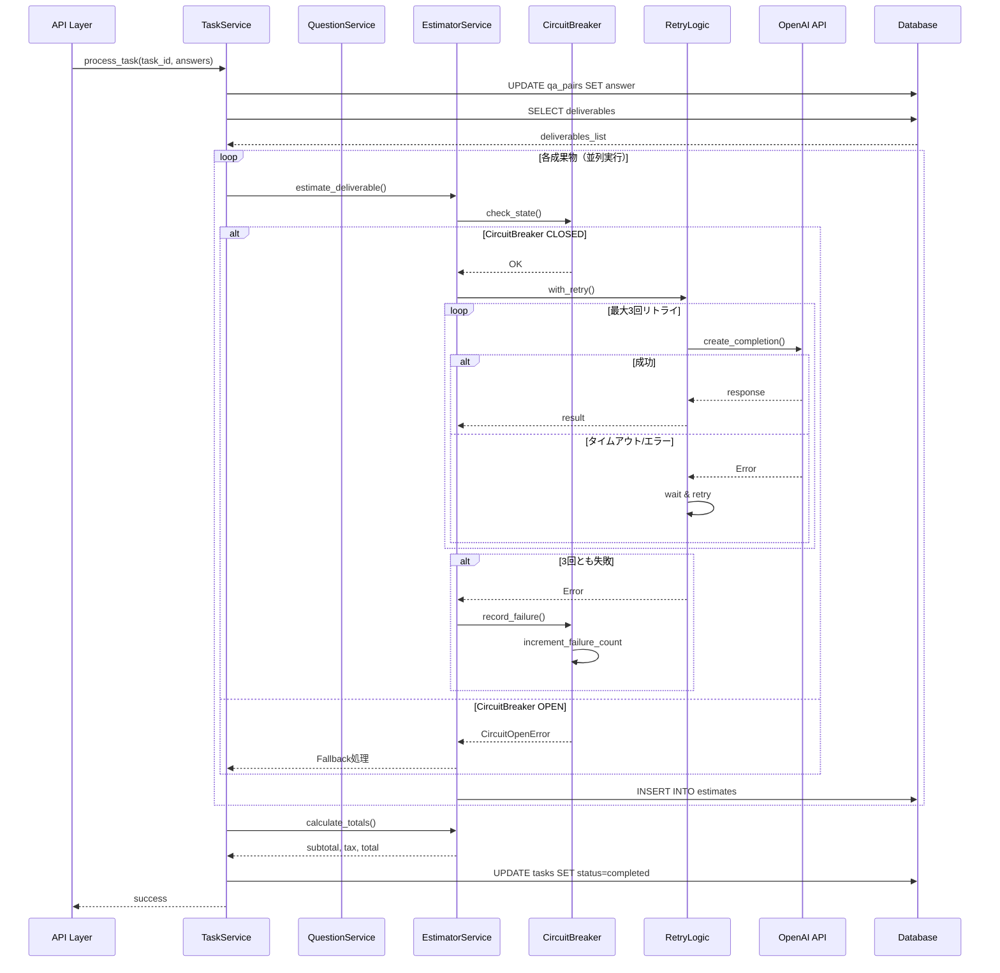

---

## データモデル

### ER図

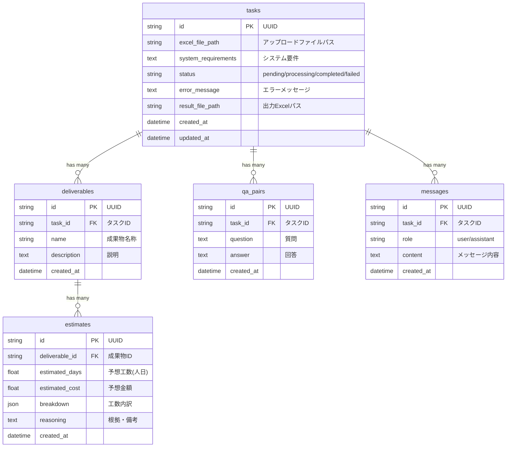

### データモデル関連

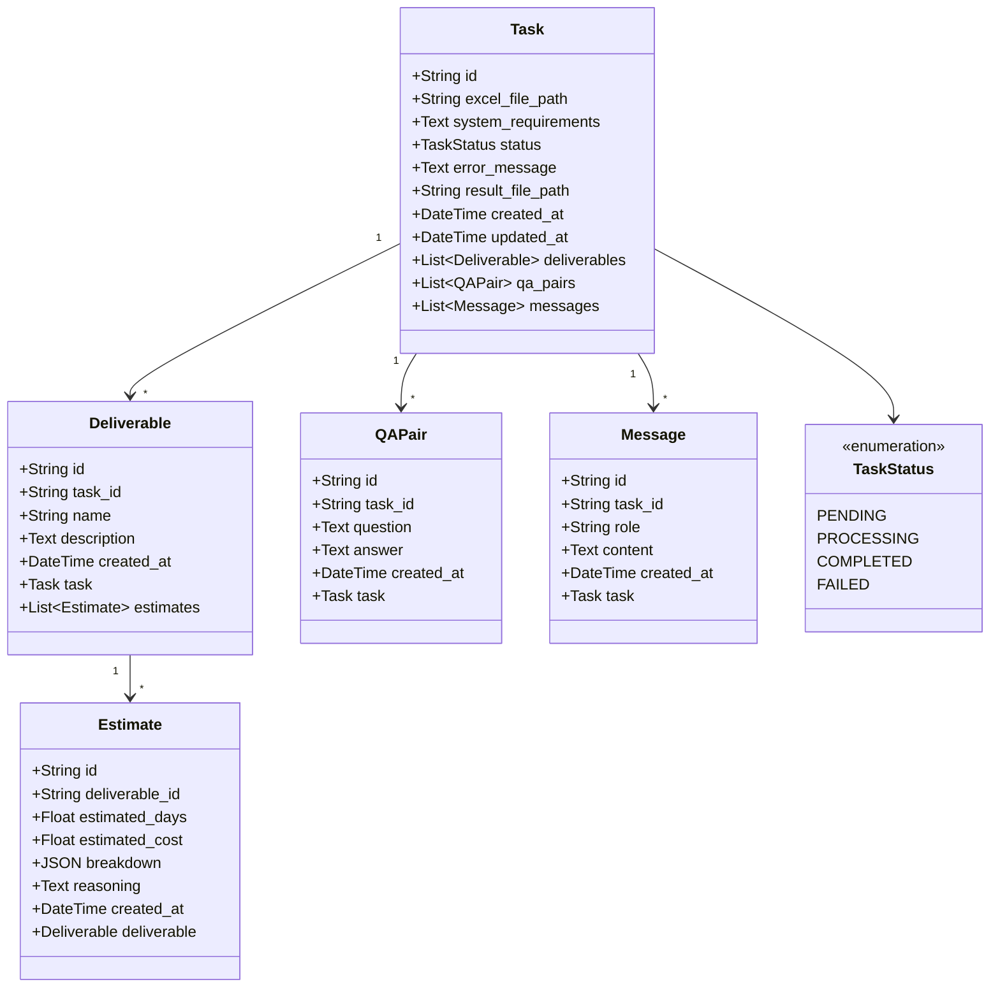

---

## ディレクトリ構造

```
output3/backend/
├── app/
│   ├── main.py                    # FastAPIアプリケーション
│   │
│   ├── api/                       # APIエンドポイント
│   │   ├── __init__.py
│   │   └── v1/
│   │       ├── __init__.py
│   │       └── tasks.py           # タスク関連API
│   │
│   ├── models/                    # SQLAlchemyモデル
│   │   ├── __init__.py
│   │   ├── task.py               # Taskモデル
│   │   ├── deliverable.py        # Deliverableモデル
│   │   ├── qa_pair.py            # QAPairモデル
│   │   ├── estimate.py           # Estimateモデル
│   │   └── message.py            # Messageモデル
│   │
│   ├── schemas/                   # Pydanticスキーマ
│   │   ├── __init__.py
│   │   ├── task.py               # タスク関連スキーマ
│   │   ├── estimate.py           # 見積り関連スキーマ
│   │   ├── qa_pair.py            # QA関連スキーマ
│   │   └── chat.py               # チャット関連スキーマ
│   │
│   ├── services/                  # ビジネスロジック
│   │   ├── __init__.py
│   │   ├── task_service.py       # タスク管理サービス
│   │   ├── question_service.py   # 質問生成サービス
│   │   ├── estimator_service.py  # 見積り計算サービス
│   │   ├── chat_service.py       # チャット調整サービス
│   │   ├── safety_service.py     # 安全性検証サービス
│   │   ├── input_service.py      # ファイル入力サービス
│   │   └── export_service.py     # Excel出力サービス
│   │
│   ├── core/                      # 共通機能・設定
│   │   ├── __init__.py
│   │   ├── config.py             # 設定管理
│   │   └── i18n.py               # 多言語対応
│   │
│   ├── db/                        # データベース
│   │   ├── __init__.py
│   │   └── database.py           # DB接続・セッション管理
│   │
│   ├── prompts/                   # LLMプロンプト
│   │   ├── __init__.py
│   │   ├── question_prompts.py   # 質問生成プロンプト
│   │   ├── estimate_prompts.py   # 見積り生成プロンプト
│   │   └── chat_prompts.py       # チャット調整プロンプト
│   │
│   ├── middleware/                # ミドルウェア
│   │   ├── __init__.py
│   │   ├── circuit_breaker.py    # サーキットブレーカー
│   │   ├── loop_detector.py      # ループ検出
│   │   └── resource_limiter.py   # リソース制限
│   │
│   ├── utils/                     # ユーティリティ
│   │   ├── __init__.py
│   │   └── retry.py              # リトライロジック
│   │
│   ├── locales/                   # 多言語翻訳ファイル
│   │   ├── ja.json               # 日本語翻訳
│   │   └── en.json               # 英語翻訳
│   │
│   └── static/                    # 静的ファイル
│       ├── index.html            # メインUI
│       ├── styles.css            # スタイルシート
│       └── script.js             # クライアントサイドJS
│
├── tests/                         # テストコード
│   ├── __init__.py
│   ├── conftest.py               # pytestフィクスチャ
│   ├── unit/                     # ユニットテスト
│   │   ├── test_task_service.py
│   │   ├── test_estimator_service.py
│   │   └── test_safety_service.py
│   ├── integration/              # 統合テスト
│   │   ├── test_api_tasks.py
│   │   └── test_database.py
│   └── e2e/                      # E2Eテスト
│       └── test_full_workflow.py
│
├── .env                          # 環境変数
├── .env.sample                   # 環境変数サンプル
├── requirements.txt              # Python依存関係
├── pytest.ini                    # pytest設定
└── app.db                        # SQLiteデータベース
```

---

## セキュリティアーキテクチャ

### 多層防御

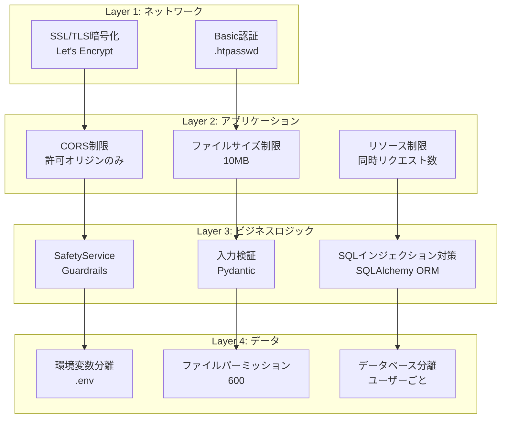

### Guardrails実装

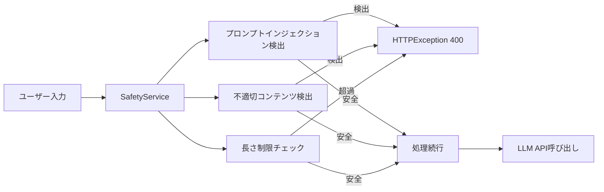

**実装箇所**:
- `app/services/safety_service.py`
- `app/api/v1/tasks.py` (create_task, chat)

---

## レジリエンスアーキテクチャ

### CircuitBreaker パターン

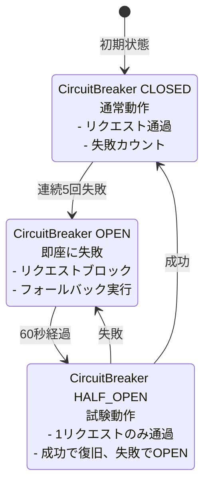

**設定**:
- 失敗閾値: 5回
- タイムアウト: 60秒
- ハーフオープン試行回数: 1回

**実装**: `app/middleware/circuit_breaker.py`

### Retry ロジック

```mermaid
graph TB
    Start[API呼び出し開始] --> Try1[1回目試行]

    Try1 --> |成功| Success[成功]
    Try1 --> |失敗| Wait1[1秒待機]

    Wait1 --> Try2[2回目試行]
    Try2 --> |成功| Success
    Try2 --> |失敗| Wait2[2秒待機<br/>Exponential Backoff]

    Wait2 --> Try3[3回目試行]
    Try3 --> |成功| Success
    Try3 --> |失敗| Failure[失敗<br/>CircuitBreakerへ記録]

    Success --> [*]
    Failure --> [*]
```

**設定**:
- 最大リトライ回数: 3回
- バックオフ戦略: Exponential (1秒, 2秒, 4秒)
- リトライ対象エラー: Timeout, RateLimitError, APIConnectionError

**実装**: `app/utils/retry.py`

### Loop Detector

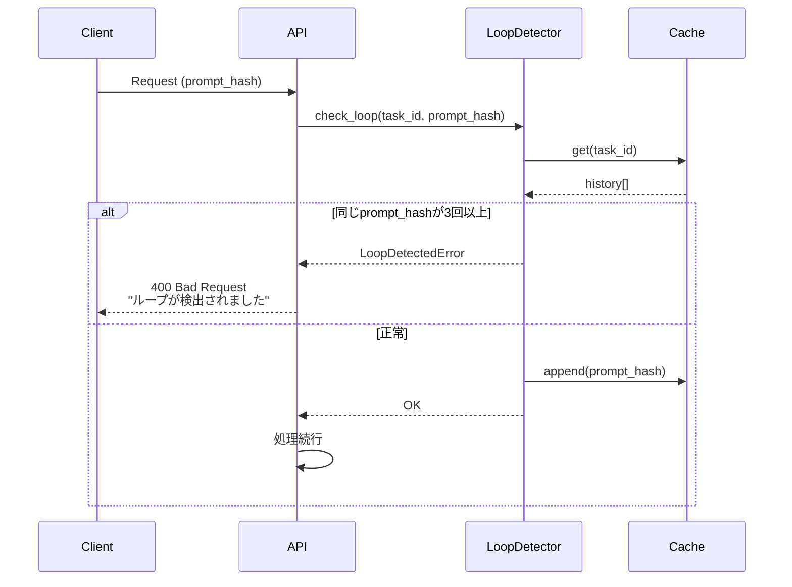

**設定**:
- ループ検出閾値: 3回
- キャッシュ保持時間: 1時間

**実装**: `app/middleware/loop_detector.py`

### Resource Limiter

```mermaid
graph TB
    Request[リクエスト受信] --> Check[同時実行数チェック]

    Check --> |< MAX_CONCURRENT| Acquire[セマフォ取得]
    Check --> |>= MAX_CONCURRENT| Wait[キューで待機<br/>最大30秒]

    Wait --> |タイムアウト| Reject[503 Service Unavailable]
    Wait --> |取得可能| Acquire

    Acquire --> Process[処理実行]
    Process --> Release[セマフォ解放]
    Release --> Response[レスポンス返却]

    Reject --> [*]
    Response --> [*]
```

**設定**:
- 最大同時実行数: 5
- タイムアウト: 30秒

**実装**: `app/middleware/resource_limiter.py`

---

## 多言語アーキテクチャ

### 翻訳システム

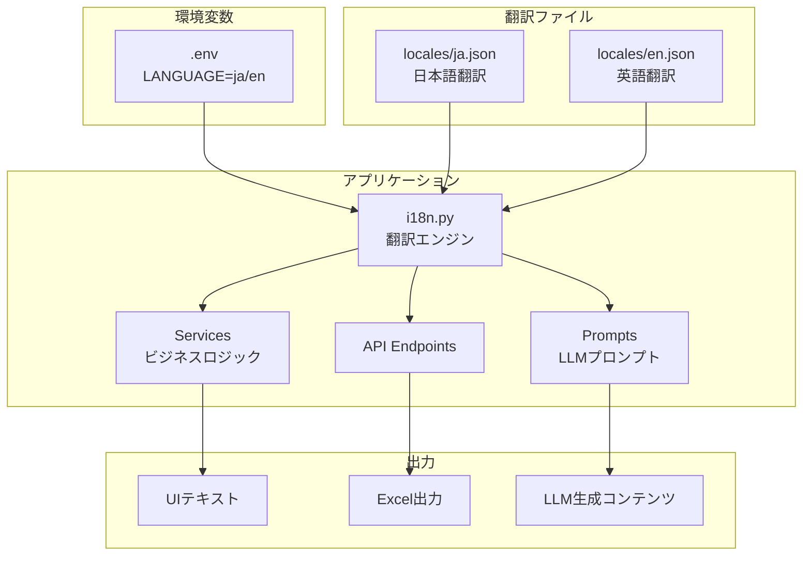

**翻訳関数**:
```python
from app.core.i18n import t

# UIテキスト
title = t('ui.app_title')

# LLMプロンプト
language_instruction = t('prompts.language_instruction')

# Excel列名
column_name = t('excel.column_deliverable_name')
```

**翻訳ファイル構造**:
```json
{
  "ui": { "app_title": "..." },
  "prompts": { "language_instruction": "..." },
  "excel": { "column_deliverable_name": "..." },
  "messages": { "error_message": "..." }
}
```

---

## パフォーマンス最適化

### 並列処理

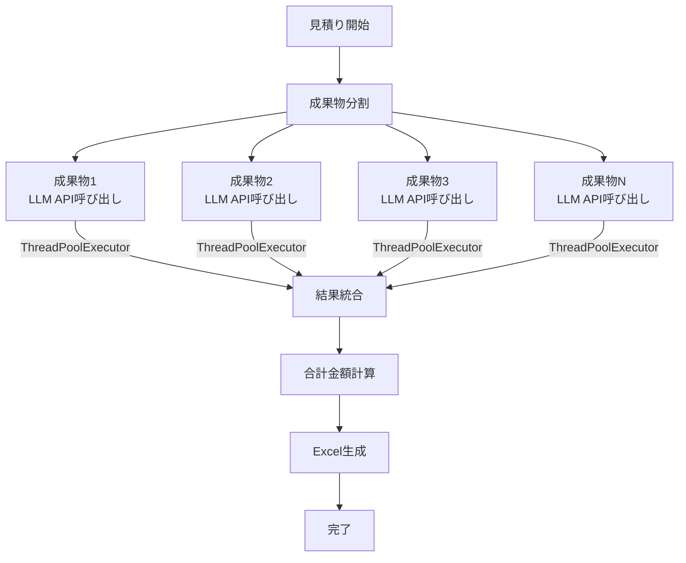

**実装**: `app/services/task_service.py`
- `ThreadPoolExecutor` で並列実行
- 最大ワーカー数: 10

### キャッシング

```mermaid
graph LR
    Request[リクエスト] --> CheckCache{キャッシュ確認}

    CheckCache --> |HIT| CacheReturn[キャッシュ返却]
    CheckCache --> |MISS| Process[処理実行]

    Process --> LLM[LLM API呼び出し]
    LLM --> SaveCache[キャッシュ保存]
    SaveCache --> Return[結果返却]

    CacheReturn --> [*]
    Return --> [*]
```

**キャッシュ対象**:
- 質問生成結果（タスクIDごと）
- 調整提案（タスクID + リクエストハッシュ）

**TTL**: 1時間

---

## 参考資料

- [DEPLOYMENT.md](../deployment/DEPLOYMENT.md) - デプロイメントガイド
- [DEVELOPER_GUIDE.md](../development/DEVELOPER_GUIDE.md) - 開発者ガイド
- [API_REFERENCE.md](../development/API_REFERENCE.md) - APIリファレンス
- [SECURITY_CHECKLIST.md](../security/SECURITY_CHECKLIST.md) - セキュリティチェックリスト

---

**最終更新**: 2025-10-21
**作成者**: Claude Code
**バージョン**: 1.0
