# Architecture Documentation

## 📋 Table of Contents

1. [Overview](#overview)
2. [System Architecture](#system-architecture)
3. [Data Flow](#data-flow)
4. [Sequence Diagrams](#sequence-diagrams)
5. [Data Model](#data-model)
6. [Directory Structure](#directory-structure)
7. [Security Architecture](#security-architecture)
8. [Resilience Architecture](#resilience-architecture)
9. [Multi-language Architecture](#multi-language-architecture)
10. [Performance Optimization](#performance-optimization)

---

## Overview

### Architecture Design Principles

1. **Simplicity**: Minimal necessary components
2. **Scalability**: Support for future scaling
3. **Maintainability**: Easy to understand and modify structure
4. **Security**: Multi-layer defense for safety
5. **Resilience**: Auto-recovery from failures

### Key Technology Decisions

| Technology Selection | Reason |
|---------------------|--------|
| **FastAPI** | High performance, type safety, automatic API documentation |
| **SQLite** | Simple, file-based, no dependencies |
| **Uvicorn** | High-speed ASGI, async support |
| **Apache HTTPD** | Proven track record, SSL/TLS support, Basic authentication |
| **OpenAI API** | High accuracy AI, cost-effective (gpt-4o-mini) |
| **systemd** | Standard process management, automatic restart |

---

## System Architecture

### Overall Architecture Diagram

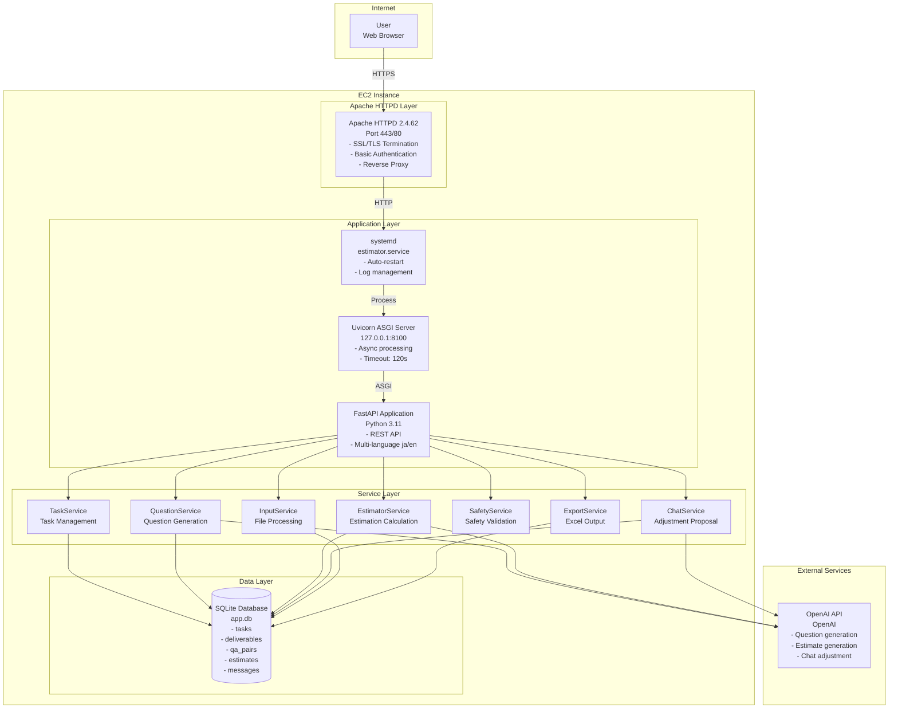

### Layer Details

#### 1. Frontend Layer

**Components**:
- Vanilla JavaScript
- Chart.js (graph rendering)
- HTML5/CSS3

**Responsibilities**:
- User interface display
- User input collection
- API calls
- Result visualization

#### 2. Proxy Layer (Apache HTTPD)

**Responsibilities**:
- SSL/TLS termination
- Basic authentication
- Reverse proxy
- HTTP→HTTPS redirect

**Configuration**:
```apache
ProxyPass /api/ http://127.0.0.1:8100/api/ timeout=600
ProxyPass /static/ http://127.0.0.1:8100/static/ timeout=600
ProxyPass / http://127.0.0.1:8100/ui/ timeout=600
```

#### 3. Application Layer (FastAPI)

**Responsibilities**:
- REST API endpoint provision
- Request validation
- Business logic execution
- Response generation

**Main Endpoints**:
- `POST /api/v1/tasks` - Create task
- `GET /api/v1/tasks/{id}/questions` - Get questions
- `POST /api/v1/tasks/{id}/answers` - Submit answers
- `GET /api/v1/tasks/{id}/result` - Get results
- `POST /api/v1/tasks/{id}/chat` - Adjustment request

#### 4. Service Layer

**TaskService**:
- Task lifecycle management
- Overall estimation process control

**QuestionService**:
- AI question generation
- OpenAI API integration

**EstimatorService**:
- Estimation calculation logic
- Effort and cost calculation

**ChatService**:
- Adjustment proposal generation
- AI dialogue control

**SafetyService**:
- Prompt injection detection
- Inappropriate content filtering

**InputService**:
- Excel/CSV parsing
- Data extraction and validation

**ExportService**:
- Excel file generation
- Format styling

#### 5. Data Layer (SQLite)

**Responsibilities**:
- Data persistence
- Transaction management
- Query execution

---

## Data Flow

### Task Creation to Estimation Generation Flow

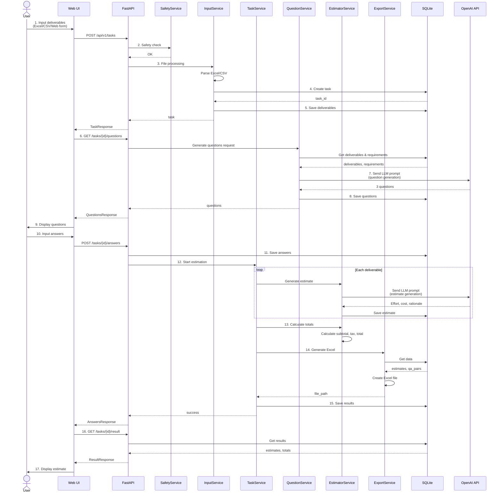

### Chat Adjustment Flow

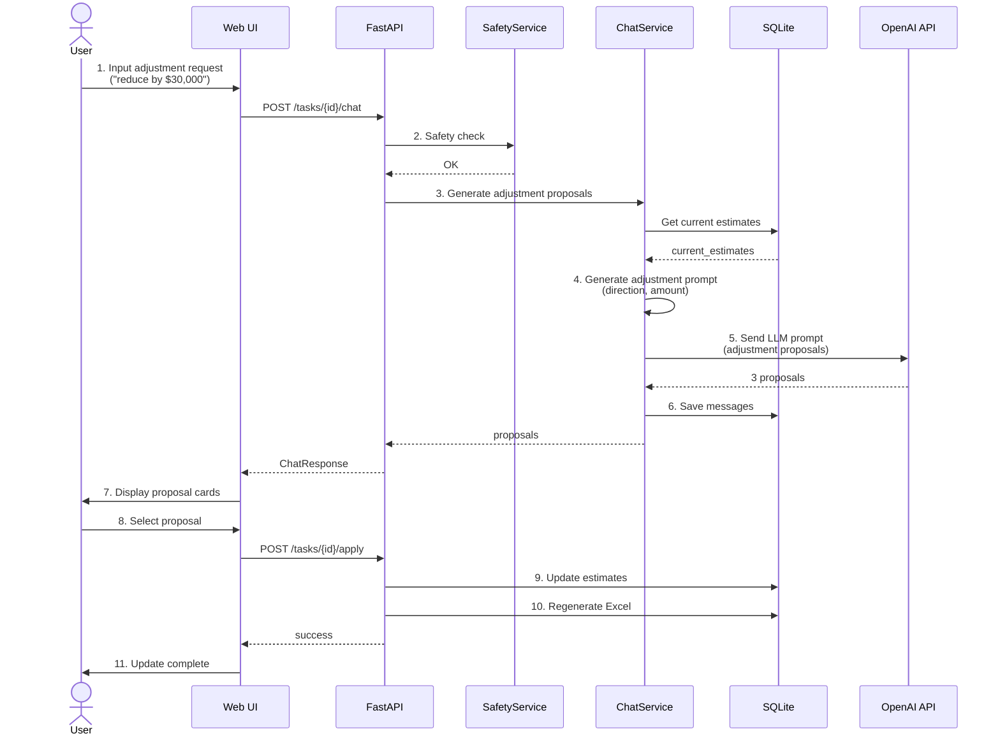

---

## Sequence Diagrams

### Task Creation Detailed Sequence

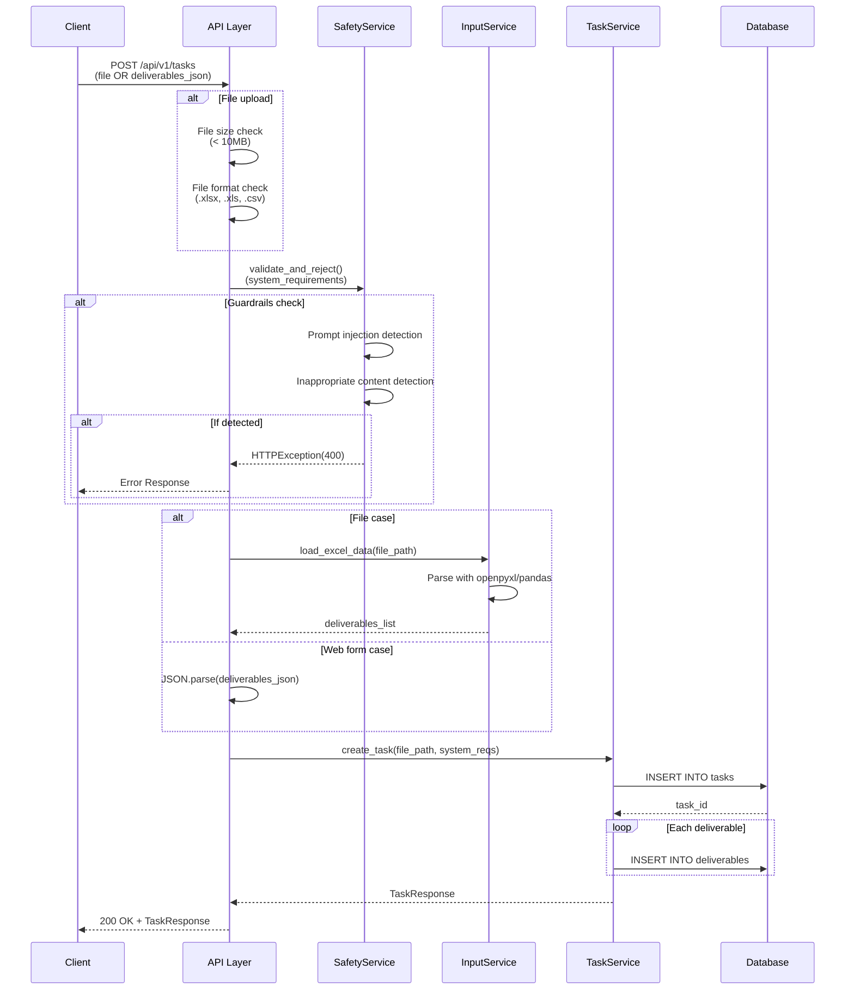

### Estimation Generation Detailed Sequence

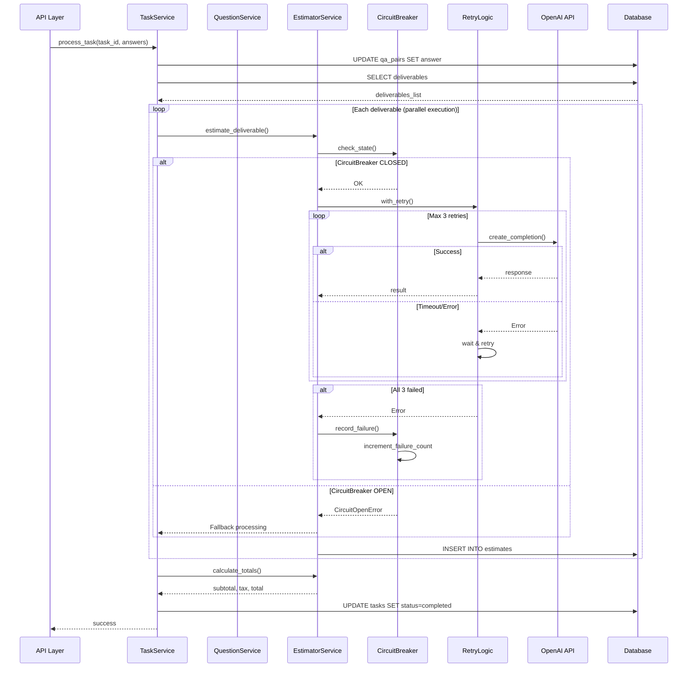

---

## Data Model

### ER Diagram

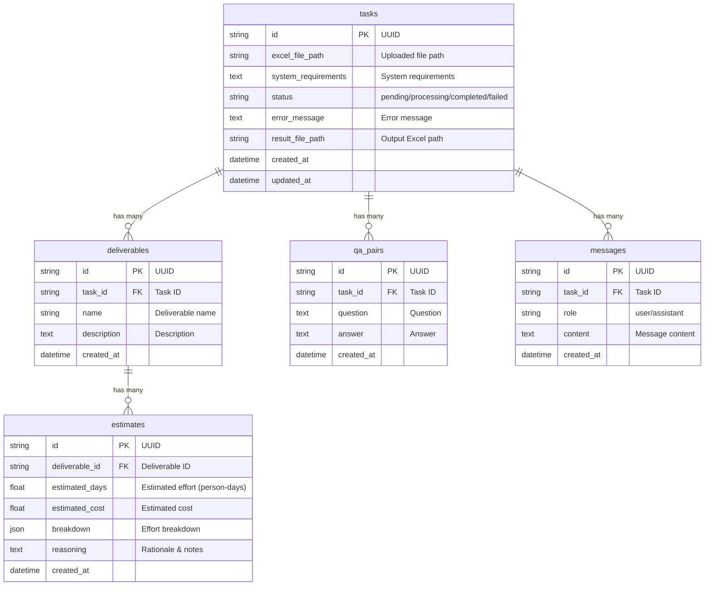

### Data Model Relationships

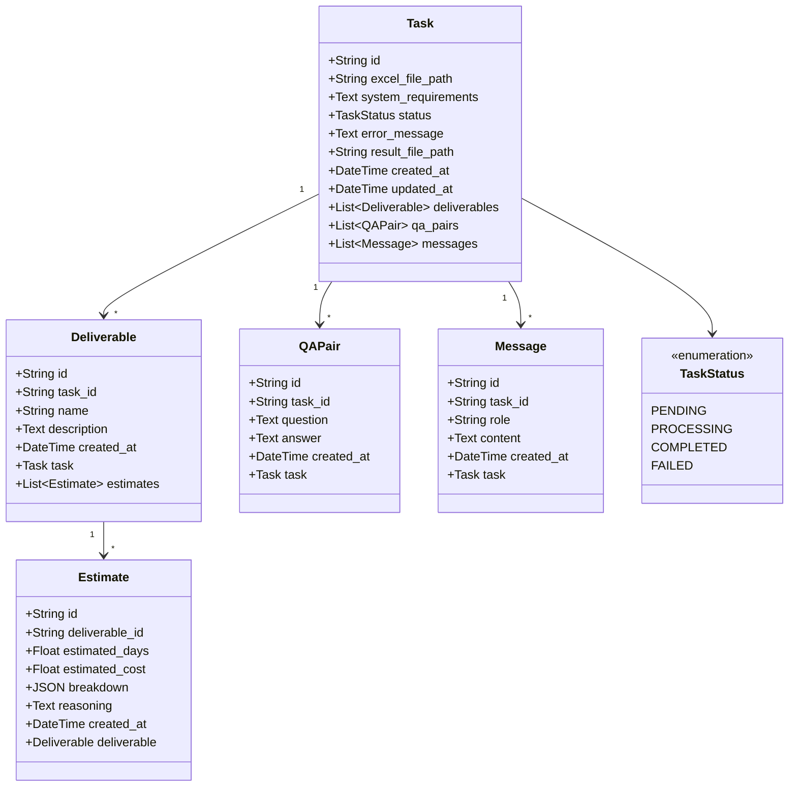

---

## Directory Structure

```
output3/backend/
├── app/
│   ├── main.py                    # FastAPI application
│   │
│   ├── api/                       # API endpoints
│   │   ├── __init__.py
│   │   └── v1/
│   │       ├── __init__.py
│   │       └── tasks.py           # Task-related API
│   │
│   ├── models/                    # SQLAlchemy models
│   │   ├── __init__.py
│   │   ├── task.py               # Task model
│   │   ├── deliverable.py        # Deliverable model
│   │   ├── qa_pair.py            # QAPair model
│   │   ├── estimate.py           # Estimate model
│   │   └── message.py            # Message model
│   │
│   ├── schemas/                   # Pydantic schemas
│   │   ├── __init__.py
│   │   ├── task.py               # Task-related schemas
│   │   ├── estimate.py           # Estimate-related schemas
│   │   ├── qa_pair.py            # QA-related schemas
│   │   └── chat.py               # Chat-related schemas
│   │
│   ├── services/                  # Business logic
│   │   ├── __init__.py
│   │   ├── task_service.py       # Task management service
│   │   ├── question_service.py   # Question generation service
│   │   ├── estimator_service.py  # Estimation calculation service
│   │   ├── chat_service.py       # Chat adjustment service
│   │   ├── safety_service.py     # Safety validation service
│   │   ├── input_service.py      # File input service
│   │   └── export_service.py     # Excel output service
│   │
│   ├── core/                      # Common functions & config
│   │   ├── __init__.py
│   │   ├── config.py             # Configuration management
│   │   └── i18n.py               # Multi-language support
│   │
│   ├── db/                        # Database
│   │   ├── __init__.py
│   │   └── database.py           # DB connection & session management
│   │
│   ├── prompts/                   # LLM prompts
│   │   ├── __init__.py
│   │   ├── question_prompts.py   # Question generation prompts
│   │   ├── estimate_prompts.py   # Estimation generation prompts
│   │   └── chat_prompts.py       # Chat adjustment prompts
│   │
│   ├── middleware/                # Middleware
│   │   ├── __init__.py
│   │   ├── circuit_breaker.py    # Circuit breaker
│   │   ├── loop_detector.py      # Loop detection
│   │   └── resource_limiter.py   # Resource limiting
│   │
│   ├── utils/                     # Utilities
│   │   ├── __init__.py
│   │   └── retry.py              # Retry logic
│   │
│   ├── locales/                   # Multi-language translation files
│   │   ├── ja.json               # Japanese translations
│   │   └── en.json               # English translations
│   │
│   └── static/                    # Static files
│       ├── index.html            # Main UI
│       ├── styles.css            # Stylesheet
│       └── script.js             # Client-side JS
│
├── tests/                         # Test code
│   ├── __init__.py
│   ├── conftest.py               # pytest fixtures
│   ├── unit/                     # Unit tests
│   │   ├── test_task_service.py
│   │   ├── test_estimator_service.py
│   │   └── test_safety_service.py
│   ├── integration/              # Integration tests
│   │   ├── test_api_tasks.py
│   │   └── test_database.py
│   └── e2e/                      # E2E tests
│       └── test_full_workflow.py
│
├── .env                          # Environment variables
├── .env.sample                   # Environment variables sample
├── requirements.txt              # Python dependencies
├── pytest.ini                    # pytest configuration
└── app.db                        # SQLite database
```

---

## Security Architecture

### Multi-layer Defense

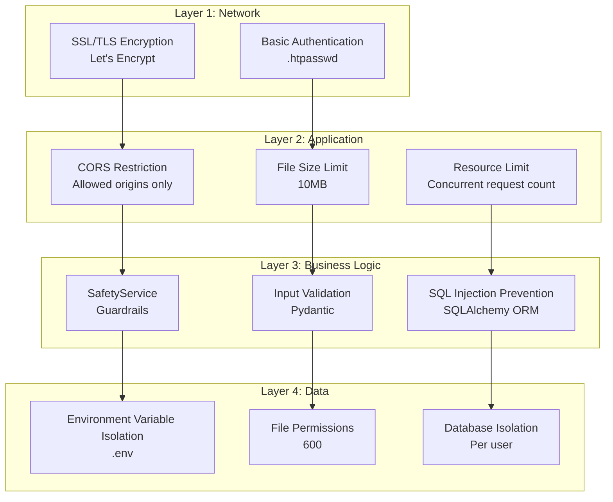

### Guardrails Implementation

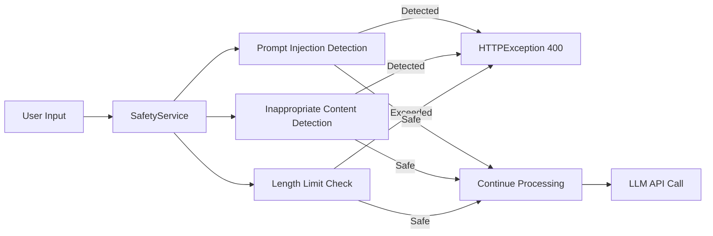

**Implementation**:
- `app/services/safety_service.py`
- `app/api/v1/tasks.py` (create_task, chat)

---

## Resilience Architecture

### CircuitBreaker Pattern

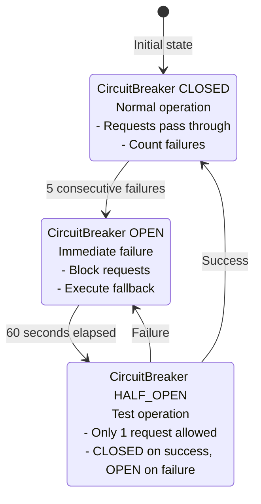

**Configuration**:
- Failure threshold: 5 times
- Timeout: 60 seconds
- Half-open retry count: 1 time

**Implementation**: `app/middleware/circuit_breaker.py`

### Retry Logic

```mermaid
graph TB
    Start[Start API Call] --> Try1[1st Attempt]

    Try1 --> |Success| Success[Success]
    Try1 --> |Failure| Wait1[Wait 1 second]

    Wait1 --> Try2[2nd Attempt]
    Try2 --> |Success| Success
    Try2 --> |Failure| Wait2[Wait 2 seconds<br/>Exponential Backoff]

    Wait2 --> Try3[3rd Attempt]
    Try3 --> |Success| Success
    Try3 --> |Failure| Failure[Failure<br/>Record to CircuitBreaker]

    Success --> [*]
    Failure --> [*]
```

**Configuration**:
- Maximum retry count: 3 times
- Backoff strategy: Exponential (1s, 2s, 4s)
- Retry-eligible errors: Timeout, RateLimitError, APIConnectionError

**Implementation**: `app/utils/retry.py`

### Loop Detector

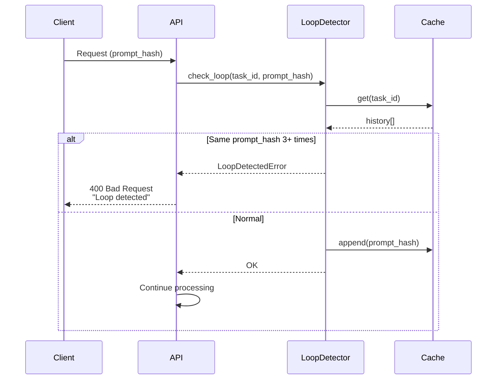

**Configuration**:
- Loop detection threshold: 3 times
- Cache retention time: 1 hour

**Implementation**: `app/middleware/loop_detector.py`

### Resource Limiter

```mermaid
graph TB
    Request[Receive Request] --> Check[Check concurrent execution count]

    Check --> |< MAX_CONCURRENT| Acquire[Acquire semaphore]
    Check --> |>= MAX_CONCURRENT| Wait[Wait in queue<br/>Max 30 seconds]

    Wait --> |Timeout| Reject[503 Service Unavailable]
    Wait --> |Available| Acquire

    Acquire --> Process[Execute processing]
    Process --> Release[Release semaphore]
    Release --> Response[Return response]

    Reject --> [*]
    Response --> [*]
```

**Configuration**:
- Maximum concurrent executions: 5
- Timeout: 30 seconds

**Implementation**: `app/middleware/resource_limiter.py`

---

## Multi-language Architecture

### Translation System

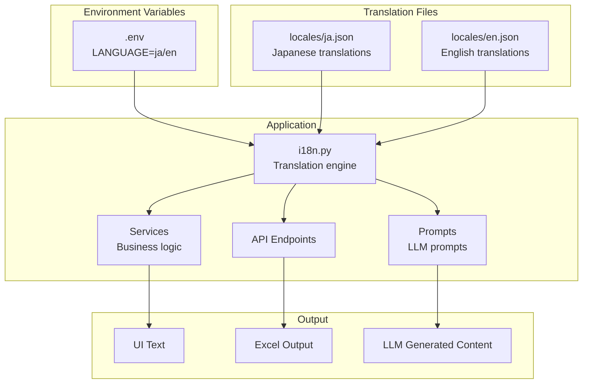

**Translation Function**:
```python
from app.core.i18n import t

# UI text
title = t('ui.app_title')

# LLM prompt
language_instruction = t('prompts.language_instruction')

# Excel column name
column_name = t('excel.column_deliverable_name')
```

**Translation File Structure**:
```json
{
  "ui": { "app_title": "..." },
  "prompts": { "language_instruction": "..." },
  "excel": { "column_deliverable_name": "..." },
  "messages": { "error_message": "..." }
}
```

---

## Performance Optimization

### Parallel Processing

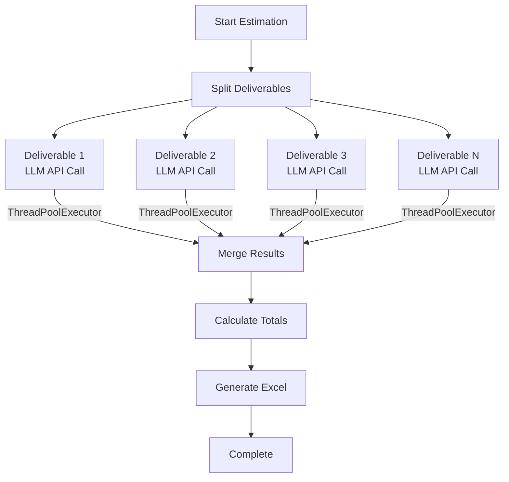

**Implementation**: `app/services/task_service.py`
- Parallel execution with `ThreadPoolExecutor`
- Maximum workers: 10

### Caching

```mermaid
graph LR
    Request[Request] --> CheckCache{Check Cache}

    CheckCache --> |HIT| CacheReturn[Return from Cache]
    CheckCache --> |MISS| Process[Execute Processing]

    Process --> LLM[LLM API Call]
    LLM --> SaveCache[Save to Cache]
    SaveCache --> Return[Return Result]

    CacheReturn --> [*]
    Return --> [*]
```

**Cache Targets**:
- Question generation results (per task ID)
- Adjustment proposals (task ID + request hash)

**TTL**: 1 hour

---

## References

- [DEPLOYMENT.md](../deployment/DEPLOYMENT.md) - Deployment Guide
- [DEVELOPER_GUIDE.md](../development/DEVELOPER_GUIDE.md) - Developer Guide
- [API_REFERENCE.md](../development/API_REFERENCE.md) - API Reference
- [SECURITY_CHECKLIST.md](../security/SECURITY_CHECKLIST.md) - Security Checklist

---

**Last Updated**: 2025-10-21
**Author**: Claude Code
**Version**: 1.0
